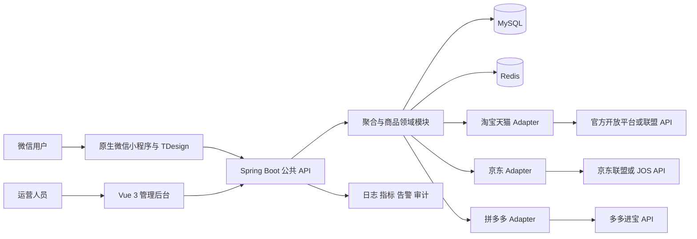

# 多平台服装聚合比价导购微信小程序项目计划

版本：v1.1  
状态：已批准的执行基线  
负责人：czx  
编制日期：2026-09-13  
修订日期：2026-09-13  
修订依据：`docs/adr/0001-mock-first-platform-access-deferral.md`  
适用对象：产品负责人、架构负责人、开发人员、测试人员、运维人员和 Codex  

> 本计划把项目定义为面向大众的服装搜索、聚合、筛选、比价、收藏和导购微信小程序。第一版不做跨平台统一购物车、统一结算、代收款或平台订单创建。小程序展示的是各平台允许推广的真实商品数据，购买行为通过平台批准的链接、小程序路径或其他合规方式回到对应平台完成。

<!-- DOCX_BODY -->

## 1 执行摘要

项目在 Tencent TDesign Retail 零售模板上二次开发，保留已经成熟的页面、组件、样式和交互骨架，把 `services -> model -> mock` 的数据链路逐步替换为 `services -> 自有后端 API -> 平台 Adapter -> 官方平台 API`。后端采用 Spring Boot 与 RuoYi-Vue-Plus 稳定版本构成模块化单体，MySQL 保存持久化业务事实，Redis 保存可重建缓存，Vue 3、TypeScript 和 Element Plus 管理后台承担平台配置、商品巡检、类目映射、规则管理、审计和运行监控。

项目按 P0 到 P14 推进。每一阶段都有明确目标、范围边界和可验证的退出条件。没有通过当前阶段验收，不进入依赖该阶段的后续工作。淘宝或天猫、京东、拼多多的接入顺序由 P1 的资质、接口权限、数据字段、推广链接和微信跳转验证结果决定，而不是预先写死。

根据 ADR-0001，P1 分为已完成的公开资料与候选技术调查 P1-A，以及依赖运营主体、平台账号和微信真机环境的 P1-B。P1-B 当前处于 `DEFERRED / EXTERNAL BLOCKER`，P1 整体仍为未完成。为避免外部授权阻塞内部工程建设，P2 到 P5 可在 P0、P1-A 和 ADR-0001 已完成的前提下使用明确标识的 Mock 与 fixtures 推进；P6 及后续真实平台 Adapter 仍必须重新满足正式权限、正式接口、转链和真机验证硬门禁。

## 2 项目定位与产品边界

### 2.1 目标用户与核心场景

目标用户是希望在多个主流网购平台中快速查找大众服装的微信用户。首版支持关键词搜索、类目浏览、平台筛选、价格筛选、优惠信息、商品详情、收藏、浏览记录、平台来源识别和合规跳转。用户始终能够看到商品来自哪个平台、价格何时更新、优惠条件是否完整以及购买将发生在哪里。

### 2.2 产品目标

- 在一个小程序中展示至少两个已经取得正式权限的平台真实服装商品，第三个平台在权限具备后接入。
- 同一套公共 API 返回统一字段，平台字段变化不要求小程序页面同步重写。
- 单个平台故障时保留其他平台结果，并明确提示结果可能不完整。
- 商品价格、优惠、库存提示和推广链接都带来源与更新时间，避免把缓存值伪装为实时值。
- 复用成熟开源基础设施和官方 SDK，把开发时间集中在聚合、标准化、排序、运营和用户体验上。

### 2.3 第一版不做的事情

- 禁止抓取淘宝、天猫、京东或拼多多网页，不绕过登录、风控、验证码或接口权限。
- 不在本系统创建外部平台订单，不代收货款，不维护收货地址和售后流程。
- 不承诺所有平台都能从微信直接跳转；只实现平台与微信当前规则允许、并经过真机验证的路径。
- 不用标题相似度把不同商品强行认定为同款；没有可靠标识时只做“相似结果分组”。
- 不在首版建设微服务、消息队列、搜索集群、推荐系统或数据仓库。
- 不把佣金高低作为未披露的唯一排序依据。

## 3 Tencent TDesign Retail 现有基线

[Tencent TDesign Retail](https://github.com/Tencent/tdesign-miniprogram-starter-retail) 是原生 JavaScript、WXML、WXSS 与 TDesign Miniprogram 构建的零售模板，包含首页、商品、购物车、订单、个人中心、优惠和售后等页面，并使用 mock 数据展示传统单店商城流程。它继续作为小程序端的视觉和交互基线，不推倒重写。

| 现有模块 | 处理方式 | 第一版结果 |
|---|---|---|
| `pages/home` | 保留并改造数据源 | 聚合首页、平台入口、热门类目和运营位 |
| `pages/goods` | 重点改造 | 搜索、列表、筛选、详情和来源说明 |
| `pages/cart` | 改名并重构 | “比价清单”或“收藏清单”，不提供统一结算 |
| `pages/order` | 首版下线 | 不展示本系统无法保证完整性的外部订单 |
| `pages/usercenter` | 保留并精简 | 收藏、浏览记录、反馈、隐私与账号设置 |
| `pages/coupon` | 受控复用 | 只展示平台 API 返回且条件明确的优惠信息 |
| 地址与售后页面 | 首版移除入口 | 购买与售后回到商品所属平台处理 |
| `components` 与 `style` | 最大限度复用 | 只新增聚合业务缺少的组件 |
| `services` | 保留接口职责并重写实现 | 统一访问自有后端 API |
| `model` | 逐步淘汰 | 仅在开发和自动化测试中保留固定测试数据 |

开始 P0 时必须对实际项目提交做一次页面、组件、服务、依赖和许可证清单。上表是迁移原则，不替代对当前代码的检查。

## 4 总体技术架构



### 4.1 架构决策

| 层级 | 选型 | 责任边界 |
|---|---|---|
| 小程序 | 原生微信小程序与 TDesign Miniprogram | 页面展示、交互、轻量本地状态、登录态和后端调用 |
| 小程序基线 | Tencent TDesign Retail | 复用零售页面、组件、样式和交互模式 |
| 后端 | Spring Boot 与 RuoYi-Vue-Plus 稳定分支 | 鉴权、权限、配置、审计、领域服务和平台接入 |
| 后端形态 | 模块化单体 | 单一部署单元，模块边界清晰，暂不拆微服务 |
| 数据访问 | MyBatis-Plus | 沿用 RuoYi-Vue-Plus 已有模式，不重复建设 ORM 基础设施 |
| 管理后台 | Vue 3、TypeScript、Element Plus | 运营、配置、映射、审计、告警和人工处置 |
| 持久化 | MySQL 8 系列 | 用户、收藏、商品当前态、快照、映射、规则和审计 |
| 缓存 | Redis | 搜索、详情、限流、幂等和短期锁；不是事实来源 |
| 平台接入 | Adapter 模式 | 签名、请求、限流、字段映射、错误转换和健康检查 |
| 部署 | Docker、Nginx、独立环境配置 | 开发、测试、预发布和生产环境一致化 |

### 4.2 模块化单体边界

- `identity`：微信登录、用户资料最小集、管理端权限。
- `catalog`：统一商品报价、类目、品牌、属性、图片和商品状态。
- `aggregation`：并发查询、超时预算、降级、合并、去重分组、排序和分页。
- `platform-adapter`：每个平台的官方 API 客户端、签名、配额、字段映射和错误转换。
- `promotion`：推广位、合规链接生成、失效时间和点击归因。
- `engagement`：收藏、浏览记录、比价清单和反馈。
- `operations`：平台开关、类目映射、规则配置、数据巡检、审计和告警。
- `shared-kernel`：金额、时间、分页、错误码和追踪标识等稳定公共类型；禁止堆放业务杂项。

模块只通过明确接口通信。平台 SDK 对象只能存在于对应 Adapter 内；控制器、数据库实体和小程序响应不得直接引用平台 SDK 类型。

## 5 关键数据流与失败策略

### 5.1 商品搜索

1. 小程序提交关键词、类目、平台、价格范围、排序和游标。
2. 公共 API 校验长度、字符、枚举、范围、频率和用户权限，不接受客户端指定任意上游地址。
3. 聚合模块读取平台开关、超时预算、类目映射和缓存策略。
4. 命中可用缓存时返回缓存，并包含数据更新时间；未命中时并发调用已启用 Adapter。
5. Adapter 负责签名、限流、重试和字段映射，返回统一商品报价，不返回原始 SDK 对象。
6. 聚合模块过滤无效结果，按稳定规则排序，执行确定性去重和可解释的相似分组。
7. 结果写入短期缓存并返回；单个平台失败时返回部分结果和平台状态。

### 5.2 商品详情与购买跳转

详情页先读取统一商品当前态，再按新鲜度策略决定是否刷新。用户点击“去平台购买”时，后端重新检查商品状态并生成或读取仍有效的推广链接。跳转结果包含目标平台、有效期和批准的跳转类型。推广链接生成失败时不得回退到来源不明的普通链接，也不得记录凭据或完整签名参数。

### 5.3 超时与降级

- 每个 Adapter 有独立连接超时、读取超时、总预算、限流器和熔断状态。
- 只对明确可重试的网络错误、限流和服务端临时错误进行有限次数指数退避；签名、权限和参数错误不自动重试。
- 搜索允许部分成功，推广链接生成和登录采用失败关闭。
- 缓存回退必须显示观测时间，并设置最大陈旧窗口；超过窗口不继续展示价格承诺。
- 每次请求携带 `traceId`，日志只记录脱敏字段和平台错误分类。

## 6 统一商品模型

### 6.1 建模原则

列表和详情的基本单位是 `UnifiedProductOffer`，表示“某个平台当前允许展示和推广的一条商品报价”。跨平台同款关系使用可选的 `CanonicalProductGroup` 表达，并记录匹配依据和置信度。没有 GTIN、品牌型号、平台提供的标准商品标识或经过验证的精确属性组合时，不生成确定性同款关系。

### 6.2 核心字段

| 字段 | 类型 | 必填 | 说明 |
|---|---|---|---|
| `offerId` | UUID | 是 | 系统内部稳定标识，不暴露平台密钥 |
| `platform` | Enum | 是 | `TAOBAO_TMAIL`、`JD`、`PDD` 等受控枚举 |
| `sourceProductId` | String | 是 | 平台商品标识，按平台规则存储和展示 |
| `sourceSkuId` | String | 否 | 平台 SKU 标识；没有时为空 |
| `title` | String | 是 | 清洗后的商品标题，保留原始含义 |
| `brand` | String | 否 | 标准化品牌及原始品牌文本 |
| `categoryPath` | Array | 是 | 统一类目路径和平台原始类目引用 |
| `images` | Array | 是 | 经过域名白名单与协议校验的图片地址 |
| `attributes` | Map | 否 | 尺码、颜色、材质等已映射属性 |
| `currency` | String | 是 | 首版固定 `CNY`，仍显式保存 |
| `listPriceMinor` | Long | 否 | 标价，单位为分，禁止浮点金额 |
| `salePriceMinor` | Long | 是 | 当前销售价，单位为分 |
| `coupon` | Object | 否 | 金额、门槛、有效期和适用条件 |
| `estimatedFinalPriceMinor` | Long | 否 | 只有优惠条件可验证时才计算 |
| `stockStatus` | Enum | 是 | `IN_STOCK`、`OUT_OF_STOCK`、`UNKNOWN` |
| `shop` | Object | 是 | 店铺标识、名称、类型和平台来源 |
| `salesMetric` | Object | 否 | 数值、时间窗口和平台语义，禁止直接横向混用 |
| `promotionTarget` | Object | 否 | 批准的链接、小程序路径、有效期和推广位引用 |
| `fetchedAt` | Instant | 是 | 最近一次从平台观察到数据的时间 |
| `expiresAt` | Instant | 是 | 当前数据不再可直接使用的时间 |
| `availability` | Enum | 是 | `ACTIVE`、`INACTIVE`、`RESTRICTED`、`UNKNOWN` |
| `schemaVersion` | Integer | 是 | 统一模型版本，用于兼容和迁移 |

### 6.3 数据契约保证

- 金额统一使用整数分；优惠后预估价不得小于零，也不得在条件不完整时伪造。
- 同一 `platform + sourceProductId + sourceSkuId` 的当前态写入必须幂等。
- 原始响应只在平台协议允许、排障确有必要且完成脱敏时短期保存；主业务逻辑不能依赖原始 JSON。
- 公共 API 使用版本化 DTO；数据库实体、平台 DTO 与公共 DTO 分离。
- 相似分组不能改变报价自身的来源、价格、店铺和跳转目标。

## 7 数据存储与缓存策略

### 7.1 MySQL 持久化范围

| 数据表或逻辑集合 | 用途 | 初始保留建议 |
|---|---|---|
| `product_offer_current` | 商品报价当前态 | 下架后保留 30 天再归档 |
| `product_offer_snapshot` | 价格与状态变化 | 90 天，受平台协议约束 |
| `canonical_product_group` | 可解释的跨平台相似或同款关系 | 与活跃报价同步维护 |
| `category_mapping` | 平台类目到统一类目映射 | 长期保留并审计变更 |
| `promotion_target` | 推广链接元数据和有效期 | 到期后 30 天删除敏感参数 |
| `user_favorite` | 用户收藏关系 | 用户删除或注销时清理 |
| `view_history` | 浏览记录 | 默认 90 天，允许用户清除 |
| `redirect_event` | 跳转与归因最小记录 | 默认 180 天，按协议和隐私评审调整 |
| `adapter_config_meta` | 非密钥配置、版本和开关 | 长期保留，变更进入审计 |
| `audit_log` | 管理操作和关键配置变更 | 默认 180 天，禁止记录 secret |

以上天数是工程初值，不是法律结论。P1 必须根据平台协议、微信规则、隐私政策和实际运营主体确认后固化。

### 7.2 Redis 缓存范围

- 搜索结果：建议 5 到 15 分钟，键包含规范化查询、筛选、排序、地区和模型版本。
- 商品详情：建议 5 分钟；接近优惠到期时使用更短 TTL。
- 推广链接：TTL 不得超过平台返回有效期，并预留刷新安全窗口。
- 负缓存：30 到 60 秒，防止不存在商品或临时故障被反复请求。
- 限流和幂等：按用户、IP、接口、平台和业务键设置独立窗口。
- Redis 清空后系统必须能从 MySQL 与平台 API 恢复；任何只存在于 Redis 的业务事实都视为缺陷。

## 8 公共 API 与 Adapter 契约

### 8.1 小程序公共 API 初稿

| 方法与路径 | 用途 | 关键要求 |
|---|---|---|
| `GET /api/v1/products/search` | 聚合搜索 | 游标分页、平台状态、观测时间、稳定排序 |
| `GET /api/v1/products/{offerId}` | 商品详情 | 新鲜度、优惠条件、来源和可用性 |
| `GET /api/v1/categories` | 统一类目 | 版本号和缓存协商 |
| `POST /api/v1/promotion-targets` | 生成购买目标 | 鉴权、限流、重放保护和有效期 |
| `GET /api/v1/favorites` | 收藏列表 | 用户隔离和失效商品提示 |
| `PUT /api/v1/favorites/{offerId}` | 添加收藏 | 幂等 |
| `DELETE /api/v1/favorites/{offerId}` | 删除收藏 | 幂等 |
| `GET /api/v1/view-history` | 浏览记录 | 分页、保留期和用户清除能力 |
| `POST /api/v1/redirect-events` | 记录合规跳转 | 最小化字段、去重和审计 |

API Contract 以 `docs/api/openapi.yaml` 为单一事实来源。前后端接口变更必须先改契约，再改实现和契约测试。首版明确禁止新增购物车结算、支付、收货地址和订单创建接口。

### 8.2 平台 Adapter 最小能力

- `searchProducts(query, context)`：搜索并返回统一报价页。
- `getProductDetail(sourceProductId, context)`：读取详情和新鲜度信息。
- `generatePromotionTarget(offer, context)`：生成平台批准的购买目标。
- `listCategories(context)`：在平台支持时获取类目，用于映射。
- `healthCheck()`：检查凭据、配额和最小接口可用性，不泄漏密钥。

每个 Adapter 必须有固定响应样例、契约测试、错误映射表、限流策略和沙箱或最小真实调用验证。第三方 SDK 或封装不能决定领域模型。

## 9 开源复用与许可证审查

### 9.1 不重复造轮子的执行原则

1. 写代码前先查项目现有实现，再查所选上游仓库与官方 SDK，最后才考虑新增代码。
2. 能通过稳定依赖复用时不复制源码；必须复制时只复制最小范围，并保留版权与许可证通知。
3. 不因为 GitHub 星数高就直接采用。必须检查维护活跃度、最近发布、安全公告、测试、接口匹配、许可证、传递依赖和替换成本。
4. 每个引入项登记仓库、固定版本或提交、许可证、用途、修改点、升级方式、负责人和退出方案。
5. 不直接采用来源不明的淘宝客、京东联盟或多多进宝第三方封装。官方没有合适 Java SDK 时，基于官方签名和 HTTP 文档实现薄客户端，并用平台样例做契约测试。

### 9.2 候选基线与初步结论

| 组件 | 主要用途 | 当前许可证信息 | 计划结论 |
|---|---|---|---|
| [Tencent TDesign Retail](https://github.com/Tencent/tdesign-miniprogram-starter-retail) | 小程序零售页面基线 | MIT | 批准保留，P0 固定实际提交并记录本地差异 |
| [TDesign Miniprogram](https://github.com/Tencent/tdesign-miniprogram) | 小程序 UI 组件 | MIT | 沿用现有锁定版本，升级必须做视觉回归 |
| [RuoYi-Vue-Plus 6.X](https://github.com/dromara/RuoYi-Vue-Plus/tree/6.X) | 后端与管理基础设施 | MIT | 作为候选稳定基线，P1 做裁剪、升级和兼容性验证 |
| [Spring Boot](https://github.com/spring-projects/spring-boot) | 后端运行框架 | Apache-2.0 | 跟随选定 RuoYi 稳定分支，不单独追最新版本 |
| [MyBatis-Plus](https://github.com/baomidou/mybatis-plus) | 数据访问 | Apache-2.0 | 复用 RuoYi 已集成版本 |
| [Sa-Token](https://github.com/dromara/Sa-Token) | 管理端与接口鉴权 | Apache-2.0 | 优先复用 RuoYi 集成，微信用户边界另行建模 |
| [Vue 3](https://github.com/vuejs/core) 与 [Element Plus](https://github.com/element-plus/element-plus) | 管理后台 | MIT | 使用 RuoYi 配套版本，不并行引入第二套 UI 框架 |
| MySQL Community 与 Connector J | 数据库和驱动 | 版本与分发方式相关 | P1 核对固定版本许可证、FOSS 例外和部署方式 |
| [Redis](https://redis.io/legal/licenses/) | 缓存、限流和幂等 | Redis 8 起提供 RSALv2、SSPLv1、AGPLv3 多许可证，旧版本规则不同 | P1 决定版本与托管或自建方式；未经审查不打包分发服务端 |
| 平台官方 SDK | 签名和接口调用 | 受各平台 SDK 许可与合作协议约束 | 取得权限后逐项审查；未授权前不选第三方替代品 |

许可证结论必须在固定提交或制品版本上重新核对，并生成第三方通知清单与软件物料清单。此表用于工程筛选，不替代法律意见。

### 9.3 官方平台资料入口

- 淘宝客物料搜索升级版：[淘宝开放平台 API 文档](https://developer.alibaba.com/docs/api.htm?apiId=70484)
- 京东联盟商品查询与推广链接：[京东 JOS 联盟方案](https://jos.jd.com/jdunion)
- 多多进宝商品搜索：[拼多多官方 CDN 文档](https://commoncdn.yangkeduo.com/pdd_oms/2021-01-12/2e22638bda0b0f77479f89dab1de2988.pdf)
- 微信小程序跳转能力：[微信小程序官方文档](https://developers.weixin.qq.com/miniprogram/dev/api/navigate/wx.navigateToMiniProgram.html)

P1 要用运营主体的真实申请结果验证可用接口、字段、配额、推广位、回调、商品范围、数据保留和跳转方式。公开文档可访问不等于账号已经获得权限。

## 10 建议目录结构

```text
/
├─ AGENTS.md
├─ MEMORY.md
├─ README.md
├─ docs/
│  ├─ PRD.md
│  ├─ Tech-Spec.md
│  ├─ api/openapi.yaml
│  ├─ adr/
│  ├─ licenses/
│  ├─ upstream/
│  └─ phases/
├─ apps/
│  ├─ miniprogram/
│  └─ admin/
├─ services/
│  └─ backend/
│     ├─ ruoyi-admin/
│     ├─ ruoyi-common/
│     └─ ruoyi-modules/
│        ├─ catalog/
│        ├─ aggregation/
│        ├─ platform-adapter/
│        ├─ promotion/
│        ├─ engagement/
│        └─ operations/
├─ tests/
│  ├─ contract/
│  ├─ integration/
│  ├─ e2e/
│  └─ fixtures/
├─ deploy/
│  ├─ docker/
│  ├─ nginx/
│  └─ runbooks/
└─ scripts/
```

导入 RuoYi-Vue-Plus 时优先保留其稳定分支原有模块结构，在 `ruoyi-modules` 下增加业务模块。不要为了得到整齐目录而大规模搬动上游文件，否则升级与差异追踪成本会迅速增加。

## 11 P0 到 P14 分阶段路线图

| 阶段 | 名称 | 主要输出 | 前置条件 |
|---|---|---|---|
| P0 | 基线审计 | 当前代码、页面、依赖、许可证和差异清单 | 现有 TDesign Retail 代码 |
| P1 | 合规与技术选型 | P1-A 公开调查；P1-B 账号权限、接口与跳转验证 | P0；P1-B 另需运营主体与测试账号信息 |
| P2 | 仓库与开发环境 | 单仓结构、环境模板、CI 基础和启动说明 | P0、P1-A、ADR-0001 |
| P3 | 后端与管理后台基础 | 裁剪后的 RuoYi 模块化单体、鉴权与审计 | P2 |
| P4 | 领域模型与数据库 | 统一商品模型、迁移脚本和仓储测试 | P3 |
| P5 | API 契约与 Mock Adapter | OpenAPI、固定样例、公共 API 和契约测试 | P4 |
| P6 | 第一个真实平台 | 首个可用真实 Adapter 和最小闭环 | P5、目标平台 P1-B 正式授权与验证证据 |
| P7 | 第二个真实平台 | 第二 Adapter 和部分失败降级 | P6、第二平台 P1-B 正式授权与验证证据 |
| P8 | 第三个平台 | 第三 Adapter 或有证据的延期决策 | P7、第三平台 P1-B 证据或正式延期 ADR |
| P9 | 聚合与比价能力 | 去重分组、排序、缓存、新鲜度和限流 | P7 |
| P10 | 小程序真实数据改造 | 首页、搜索、列表、详情和筛选闭环 | P5、P9 |
| P11 | 用户与导购闭环 | 登录、收藏、浏览、比价清单和合规跳转 | P10 |
| P12 | 运营管理能力 | 平台开关、映射、巡检、规则和审计 | P9、P11 |
| P13 | 非功能验收 | 安全、隐私、性能、可观测性和恢复验证 | P10 至 P12 |
| P14 | 灰度上线与交接 | 审核包、灰度、回滚演练、运行手册和复盘 | P13 |

### P0 基线审计

目标：把“当前项目是什么”变成可验证事实。  
边界：只检查和记录，不开始业务重构，不升级依赖。  
验收标准：输出页面与功能地图、mock 数据流、依赖与锁文件、许可证、构建命令、可运行截图、已知缺陷和上游提交；确认首页、商品、购物车、订单、用户中心各自的保留或下线策略；基线构建与主要页面能在微信开发者工具运行。

### P1 合规与技术选型

目标：证明至少一个平台能够合法取得商品、生成推广目标并从微信完成允许的导购路径。  
边界：不批量同步商品，不把测试凭据写入仓库，不承诺未经真机验证的跳转。  
验收标准：完成淘宝或天猫、京东、拼多多的资质和权限矩阵；记录可用接口、字段、配额、回调、数据保留和商品范围；固定 TDesign、RuoYi、JDK、Spring Boot、MySQL、Redis 和 Node 组合；保存所有许可证与第三方通知；至少一个平台用批准的测试凭据完成搜索、详情、转链和真机跳转证据。

当前状态分解：

- P1-A 公开资料与技术调查：`PASS`。能力矩阵、公开资料证据和候选版本组合已经记录。
- P1-B 账号权限与真机闭环：`DEFERRED / EXTERNAL BLOCKER`。正式账号权限、实际字段和配额、数据保存条款、转链结果及微信真机跳转均不得标记为已验证。
- P1 整体：`INCOMPLETE`，不得标记为 `PASS`。

门禁调整：P1-B 暂缓不阻塞 P2 到 P5 的 Mock-first 工程工作，但 P1 原验收标准没有删除或降低。进入 P6 前，目标平台必须完成正式授权、正式接口、搜索、详情、转链和微信真机跳转验证；没有这些证据不得实现或宣称真实 Adapter 可用。

### P2 仓库与开发环境

目标：任何开发者或 Codex 能按说明启动小程序、后端、管理后台、MySQL 和 Redis。  
边界：只建立工程骨架和自动化基础，不写真实聚合业务。  
验收标准：目录结构、`AGENTS.md`、`MEMORY.md`、PRD、Tech Spec、API Contract 和 ADR 目录就绪；`.env.example` 只含变量名；Docker 开发环境可启动；CI 能完成构建、单元测试、类型检查、lint、依赖和 secret 扫描；README 从空环境执行通过。

Mock-first 约束：P2 可以在没有真实平台凭据的情况下建立工程与环境；不得创建伪造的生产凭据或把现有小程序 Mock 当成后端数据库。

### P3 后端与管理后台基础

目标：得到可维护的 RuoYi-Vue-Plus 模块化单体基础。  
边界：不保留与本产品无关的工作流、AI、演示或多租户模块；也不重写已有权限、日志和配置能力。  
验收标准：只启用必需模块；管理端登录、角色权限、菜单、审计和健康检查通过；业务模块依赖方向有自动检查；默认账号和示例数据已清理；生产配置失败时安全退出。

Mock-first 约束：依赖平台能力的开发与验证使用固定 fixtures，不引入真实平台 SDK 调用，也不因为 P1-B 暂缓而削弱鉴权、审计或生产安全默认值。

### P4 领域模型与数据库

目标：建立统一商品报价、用户行为和运营配置的单一事实来源。  
边界：不接真实平台，不提前设计订单、支付和售后表。  
验收标准：统一字段、枚举、金额、时间和版本规则评审通过；数据库迁移可前进和回滚；唯一键、索引和外键策略有测试；同一平台报价重复写入幂等；隐私删除和失效商品处理有代表性测试。

Mock-first 约束：已存在的 30 个统一商品与 90 条 Offer 只是提前技术验证，不构成 P4 完成证据。P4 必须以正式评审后的 `UnifiedProductOffer`、数据库约束和迁移为准重新检查兼容性；若字段冲突，由 Mock 适配正式模型，不得让正式模型迁就当前 Mock。

### P5 API 契约与 Mock Adapter

目标：在没有平台凭据时打通小程序、后端和管理后台的稳定契约。  
边界：固定测试数据不得伪装为线上真实商品；平台 SDK 类型不得进入公共契约。  
验收标准：`openapi.yaml` 可校验并生成可读文档；搜索、详情、类目、收藏和推广目标接口通过契约测试；Mock Adapter 能模拟成功、空结果、限流、超时、权限错误和部分失败；错误码与追踪标识一致。

Mock-first 约束：现有小程序端 fixtures、生成器、service 和测试可以作为输入样例，但不构成 P5 的 OpenAPI、公共 API 或 Mock Adapter 验收证据。P5 仍需按正式契约完成后端 Mock Adapter 和完整错误场景测试；页面只能依赖稳定 service/API 边界，不能直接依赖 Mock。

### P6 第一个真实平台

目标：以 P1 中权限最完整的平台实现第一条真实数据闭环。  
边界：只实现计划中批准的接口与字段，不顺手接订单或佣金结算。  
验收标准：Adapter 搜索、详情、类目和转链契约测试通过；签名和时钟偏差有测试；凭据只来自 secret 管理；真实商品能在测试环境显示并完成批准的跳转；限流、超时、错误映射和日志脱敏验证通过。

硬门禁：P6 不得仅凭公开文档或 Mock 结果启动真实 Adapter 实现。目标平台必须先提供正式账号授权、获批接口、实际配额与字段、适用数据条款、有效推广位或同等推广标识，并完成正式搜索、详情、转链和微信真机跳转验证。

### P7 第二个真实平台

目标：验证 Adapter 边界确实支持第二个平台，而不是为第一个平台定制。  
边界：不得为了适配第二平台把平台特有字段塞入公共 DTO。  
验收标准：第二 Adapter 通过与 P6 相同的契约套件；两个平台可并发搜索；任一平台关闭、超时或限流时另一个平台仍返回；平台差异通过能力标记表达。

### P8 第三个平台

目标：完成第三平台接入，或基于权限和合规证据形成正式延期决定。  
边界：不使用非官方爬虫或来源不明的聚合 API 填补权限缺口。  
验收标准：若接入，必须通过同一契约套件、真机跳转和限流测试；若延期，ADR 记录缺失权限、用户影响、替代展示、复审日期和负责人，界面不得出现不可用平台入口。

### P9 聚合搜索与比价

目标：提供稳定、可解释、可降级的多平台搜索结果。  
边界：首版不引入 Elasticsearch、机器学习排序或个性化推荐。  
验收标准：排序在相同输入下稳定；金额和优惠计算准确；去重依据可追踪；相似分组不误合并来源；缓存命中、新鲜度、负缓存、限流、熔断和部分成功有测试；性能达到 P13 设定的测试门槛。

### P10 小程序真实数据改造

目标：把 TDesign Retail 的核心浏览链路切换到自有 API。  
边界：先用固定数据完成静态页面保真和截图验收，再接真实 API；不在此阶段实现用户账户扩展。  
验收标准：首页、搜索、筛选、列表和详情在主流屏幕尺寸无截断、重叠和关键图裁切；加载、空、失败、部分成功和陈旧数据状态完整；平台、更新时间和优惠条件清晰；mock 可通过测试开关使用但不进入生产。

### P11 用户与导购闭环

目标：完成微信登录、收藏、浏览记录、比价清单和购买跳转。  
边界：不建设统一购物车、收货地址、支付和外部订单中心。  
验收标准：用户数据严格隔离；收藏增删幂等；注销或删除请求可执行；失效商品有提示；跳转前重新检查推广目标；点击事件最小化、去重并可审计；真机完成至少两个已接平台的批准路径。

### P12 运营管理能力

目标：让运营人员不改代码即可管理平台、类目映射、展示规则和异常商品。  
边界：管理后台不允许查看 secret 明文，不提供任意 URL 请求或任意脚本执行。  
验收标准：平台开关、配额状态、类目映射、商品巡检、规则发布和回滚可用；高风险操作需要相应权限和二次确认；所有变更记录操作者、时间、前后值和原因；错误平台能独立停用。

### P13 安全 性能与运行准备

目标：用证据证明系统满足上线前的非功能要求。  
边界：不以开发机单次成功代替容量、故障和恢复验证。  
验收标准：完成威胁建模、依赖与镜像扫描、SBOM、许可证清单、secret 扫描、输入校验、越权、限流、SSRF、日志脱敏和隐私测试；完成代表性负载、单平台故障、Redis 清空、MySQL 备份恢复、凭据轮换和告警演练；所有阻断级问题关闭。

### P14 灰度上线与交接

目标：以可回滚方式通过微信审核并投入受控使用。  
边界：先灰度后扩大，不在发布窗口临时加入功能。  
验收标准：隐私政策、用户协议、平台来源和导购说明一致；审核材料完整；预发布冒烟和真机矩阵通过；数据库与配置回滚演练完成；监控面板、值班联系人、故障手册和停服开关就绪；灰度期无未解决阻断问题后才扩大流量。

## 12 架构管理制度

### 12.1 文档事实来源

- `docs/PRD.md` 管理用户问题、范围、流程和产品验收。
- `docs/Tech-Spec.md` 管理架构、模块、数据流、失败模式和非功能要求。
- `docs/api/openapi.yaml` 管理前后端公共接口。
- `docs/adr/` 管理不可轻易逆转的技术决策。
- `docs/upstream/` 管理上游仓库、固定提交、裁剪和升级差异。
- `docs/licenses/` 管理许可证、第三方通知、SBOM 和例外审批。
- `docs/phases/` 管理每阶段任务、验收证据和未完成项。

### 12.2 必须写 ADR 的变更

公共 API 不兼容变更、统一商品模型语义变化、数据库事实来源变化、引入新平台、新增中心化状态、拆分微服务、引入消息队列或搜索集群、改变鉴权、改变数据保留、采用高风险许可证、绕开官方 SDK、改变部署拓扑时必须写 ADR。ADR 至少包含背景、决定、替代方案、用户影响、迁移、回滚和验证。

### 12.3 架构守护规则

- 依赖方向为接口层到应用层到领域层，基础设施实现依赖领域接口，禁止反向引用。
- 平台 Adapter 可以依赖官方 SDK，领域模块不能依赖平台 SDK。
- Redis 不是事实来源；跨平台聚合失败不回滚已经成功的平台只读结果。
- 所有外部输入在边界验证；所有外部调用设置超时、配额和错误映射。
- 功能开关必须有默认值、负责人、到期或复审日期和删除计划。
- 每月检查一次上游版本、安全公告、许可证变化和本地差异；升级使用独立阶段或任务。

## 13 Codex 执行规则

### 13.1 每个任务开始前

1. 读取项目根目录 `AGENTS.md`、`MEMORY.md`、本计划和当前阶段文件。
2. 检查工作区状态、当前分支、锁文件、实际技术栈和用户未提交改动。
3. 用一句话写明本次阶段、用户价值、范围边界和完成标准。
4. 复杂变更先更新 PRD、Tech Spec、API Contract 或 ADR，再写实现代码。
5. 搜索现有代码、固定上游提交和官方 SDK；记录复用决定后再新增代码。

### 13.2 实现期间

- 一次只处理当前阶段或阶段内一个可验收切片，不跨阶段添加功能。
- 只做能追溯到验收标准的修改；不重构无关代码，不增加猜测性抽象和依赖。
- 代码、变量、注释、文件名、提交信息和技术文档使用英文；面向中国用户的界面文案和本项目计划使用中文。
- 任何 secret 只通过环境变量或批准的 secret 管理注入；禁止读取、打印或提交 secret 值。
- 外部 API 使用固定样例和契约测试；真实调用默认关闭并由环境显式启用。
- 平台规则或接口不确定时标记为未验证，并在沙箱或真机取得证据前停止相应上线结论。

### 13.3 提交前验证

- 运行受影响模块的单元测试、集成测试、契约测试、类型检查、lint 和构建。
- 修复缺陷时先复现或增加失败测试，再验证根因已消失。
- UI 修改先用固定数据完成桌面化开发者工具和真机尺寸截图检查，再接真实数据复测。
- 依赖变化重新生成锁文件、SBOM、许可证差异和漏洞扫描结果。
- 阶段报告必须列出已完成、实际验证、未验证限制、剩余风险和 `MEMORY.md` 是否更新。

### 13.4 阶段启动提示模板

```text
执行项目计划 Pn 阶段：阶段名称。
先读取 AGENTS.md、MEMORY.md、outputs/多平台服装聚合比价导购微信小程序项目计划.md，以及 docs/phases/Pn.md。
只完成本阶段验收标准，不跨阶段开发。先核对当前代码与上游固定版本，优先复用已有实现和官方 SDK。
实现前更新受影响的 PRD、Tech Spec、API Contract 或 ADR；实现后运行计划要求的测试并保存证据。
最终用中文汇报做了什么、验证结果、限制、风险，以及是否更新 MEMORY.md。
```

## 14 角色分工

| 角色 | 主要职责 | 必须批准的事项 |
|---|---|---|
| 产品负责人 czx | 产品定位、优先级、平台申请、预算、上线决定 | PRD、阶段范围、用户文案、最终上线 |
| 架构负责人 | 模块边界、数据模型、API、ADR、技术风险 | Tech Spec、公共契约、重大架构变更 |
| Codex | 按计划研究、实现、测试、记录证据和更新项目记忆 | 不代替产品、法律、平台或安全最终批准 |
| 小程序开发 | TDesign 二次开发、状态、性能和真机体验 | 页面验收和发布包 |
| 后端与集成开发 | 领域、数据库、Adapter、缓存、鉴权和审计 | 平台契约与故障策略 |
| 管理后台开发 | 运营配置、权限、巡检和审计界面 | 高风险操作流程 |
| 测试与安全 | 测试策略、自动化、威胁建模、隐私和漏洞验证 | P13 阻断项关闭 |
| 运维 | 环境、发布、监控、备份、恢复和应急 | P14 灰度、回滚和运行手册 |

一人可以承担多个角色，但批准职责不能被省略。Codex 可以准备审查材料和建议结论，不能替代平台授权、法律判断或生产发布责任。

## 15 上线标准

### 15.1 产品与体验

- 用户能完成首页、搜索、筛选、列表、详情、收藏和购买跳转的主流程。
- 已接平台和数据更新时间清晰；优惠条件、价格口径和部分结果状态不误导。
- 不可用平台入口隐藏或明确禁用；不出现假购物车、假订单或无法履约的售后承诺。
- 主流微信版本和代表性 iOS、Android 设备无阻断性布局或交互问题。

### 15.2 数据与接口

- 至少两个平台完成正式权限、真实商品、推广目标和真机跳转验证。
- 公共 API 契约、错误码、分页、幂等和版本策略稳定。
- 价格、优惠、库存提示、来源和时间戳抽样核对通过。
- 单平台故障、缓存丢失和过期数据策略符合设计。

### 15.3 安全 隐私与合规

- 微信平台规则、各联盟协议、隐私政策、用户协议和界面说明一致。
- 无硬编码凭据；secret 扫描、越权、输入校验、SSRF、限流和日志脱敏测试通过。
- 许可证、版权通知、SBOM 和高风险依赖处置完成。
- 用户可查看并清除允许清除的数据，注销和保留策略有验证证据。

### 15.4 可靠性与运维

- 代表性负载下的延迟、错误率和资源使用达到 P13 经批准的 SLO。
- 关键指标、日志、告警、追踪和审计可用，且告警经过演练。
- MySQL 备份恢复、Redis 清空恢复、配置回滚和上一版本回滚均已演练。
- 平台总开关和单平台停用开关可在不重新发布小程序的情况下生效。

### 15.5 发布决策

只有产品负责人、架构负责人、测试或安全负责人和运维负责人分别确认对应门槛后，P14 才能进入生产灰度。任何阻断级缺陷、未解决的数据误导、未获授权的平台数据、未验证的购买跳转或不可回滚的数据库变更都会阻止上线。

## 16 主要风险与控制

| 风险 | 用户影响 | 控制措施 |
|---|---|---|
| 平台接口权限或规则变化 | 商品缺失或无法跳转 | Adapter 隔离、能力矩阵、平台开关、合同与文档复审 |
| 价格和优惠过期 | 用户看到错误预估价 | 短 TTL、观测时间、条件校验、跳转前刷新、陈旧标识 |
| 错误同款合并 | 错误比价并损害信任 | 报价为基本单位、可靠标识优先、低置信度只做相似分组 |
| 单平台慢或不可用 | 搜索超时或结果不全 | 并发预算、超时、熔断、部分成功和平台状态提示 |
| 许可证或 SDK 条款不兼容 | 延迟上线或产生合规风险 | 固定版本审查、SBOM、第三方通知、例外审批和替代方案 |
| RuoYi 功能过多 | 攻击面、升级和维护成本增加 | P3 最小裁剪、关闭示例模块、保持上游差异清单 |
| 过早微服务化 | 开发与运维复杂度失控 | 首版模块化单体，只有量化瓶颈和独立扩缩需求才拆分 |
| 日志泄漏凭据或用户数据 | 安全与隐私事故 | 字段白名单、脱敏、禁止请求体全量日志、定期审计 |

## 17 首次执行顺序

1. P0 已完成并保持 `PASS`，固定当前 TDesign Retail 基线证据。
2. P1-A 已完成并保持 `PASS`；P1-B 记录为 `DEFERRED / EXTERNAL BLOCKER`，P1 整体保持 `INCOMPLETE`。
3. 在 P0、P1-A 和 ADR-0001 已完成后，可以正式启动 P2；P2 到 P5 使用明确标识的 Mock 与 fixtures 建立工程、后端、数据库、正式领域模型、API Contract 和 Mock Adapter。
4. 已提前完成的小程序 Mock Catalog 保留为技术验证，但不得抵扣 P4 或 P5 验收；正式模型与契约有冲突时修改 Mock。
5. 启动 P6 前恢复目标平台的 P1-B 硬门禁，取得正式权限、正式接口、实际字段与配额、转链和微信真机验证证据。
6. P6 到 P8 按权限成熟度逐个平台接入；每个平台复用同一契约测试，不能用爬虫或来源不明的第三方 API 替代授权。
7. P9 通过后再把真实聚合链路接入 TDesign 页面；P10 到 P12 完成用户和运营闭环，P13 集中处理上线阻断项，P14 只做受控发布和交接。

本计划的第一项可执行任务是建立 `docs/phases/P0.md`，列出当前仓库路径、上游提交、构建方法、页面清单、mock 数据流、依赖许可证、截图基线和 P0 验收命令。没有当前应用代码时，P0 的状态应标记为“等待导入现有 TDesign Retail 项目”，而不是假设已经完成。
